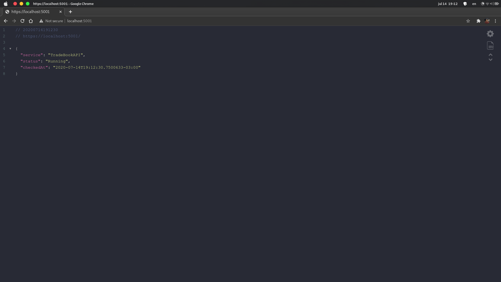

# Trade Book API

Backend API to manage a portfolio of trades.

## Prerequisites

- [.Net Core 3.1](https://dotnet.microsoft.com/download)
- [Docker](https://www.docker.com/)
- [MongoDb](https://www.mongodb.com/)
- [Redis](https://redis.io/)

## Installation

### Project Building

This documentation describes how to build the project using .NET Core CLI. If you want, these steps can be that can be performed in the Visual Studio interface.

Use the command-line interface [dotnet](https://docs.microsoft.com/pt-br/dotnet/core/tools/) to restore packages.

```bash
  dotnet restore
```

Use the [dotnet](https://docs.microsoft.com/pt-br/dotnet/core/tools/) to build your project.

```bash
  dotnet build
```

### Instantiating MongoDB and Importing Data

Create a container with MongoDB.

```bash
  docker container run -d -p 27017:27017 --name tradebook_dev_mongo mongo
```

This documentation describes how to create the database and collection using the [MongoDB shell](https://docs.mongodb.com/manual/mongo/). If you want, these steps can be that can be performed in the MongoDB Compass interface.

Execute from the container a MongoDB shell.

```bash
  docker exec -it tradebook_dev_mongo mongo
```

Switch to _TradeBookDb_ database.

```mongo
  use TradeBookDb
```

> You do not need to create the database before you switch. MongoDB creates the database when you first store data in that database (such as create the first collection in the database).

Create a _TradeCategories_ collection.

```mongo
  db.createCollection('TradeCategories')
```

The following result is displayed:

```mongo
  { "ok" : 1 }
```

Define a schema for the _TradeCategories_ collection and insert the base documents using the following command.

```mongo
  db.TradeCategories.insertMany([
    {
      name: "LowRisk",
      minimumValue: 0.0,
      limitValue: 1000000.0,
      clientSector: "Public",
      createdAt: new Date("2020-07-04T15:48:03Z"),
      updatedAt: new Date("2020-07-04T15:48:03Z"),
    },
    {
      name: "MediumRisk",
      minimumValue: 1000000.0,
      limitValue: 0.0,
      clientSector: "Public",
      createdAt: new Date("2020-07-04T15:48:03Z"),
      updatedAt: new Date("2020-07-04T15:48:03Z"),
    },
    {
      name: "HighRisk",
      minimumValue: 1000000.0,
      limitValue: 0.0,
      clientSector: "Private",
      createdAt: new Date("2020-07-04T15:48:03Z"),
      updatedAt: new Date("2020-07-04T15:48:03Z"),
    },
  ])
```

If you are using MongoDB Compass, you can import the schema and data located in `./Data/Migrations/TradeCategoriesData.json`

The following displayed result will be something like this:

```mongo
  {
    "acknowledged" : true,
    "insertedIds" : [
      ObjectId("5bfd996f7b8e48dc15ff215d"),
      ObjectId("5bfd996f7b8e48dc15ff215e"),
      ObjectId("5bfd996f7b8e48dc15ff215f")
    ]
  }
```

> The ID's shown in this documentation will not match the IDs when you run this command.

View the documents in the database using the following command:

```mongo
  db.TradeCategories.find({}).pretty()
```

Exit the MongoDB shell using the following command:

```mongo
  exit
```

### Instantiating Redis

Create a container with Redis.

```bash
  docker run -d -p 6379:6379 --name tradebook_dev_redis redis
```

If you want to connect and manage the Redis database, you can use [Redis Desktop Manager](https://redisdesktop.com/).

### Running Project

Use the [dotnet](https://docs.microsoft.com/pt-br/dotnet/core/tools/) to run your project.

```bash
  dotnet run
```

## 1.., 2.., 3.., Testing!

Using your browser, access: `https://localhost:5001/`

The following displayed result will be something like this:



> When accessing the URL for the first time, an untrusted certificate error may be displayed. This is because of its temporary development certificate. To continue access and test, enable the certificate in your browser.

## Usage

Initially, the solution is configured to run at `https://localhost:5001/`

You can check the routes available in the [API documentation](https://trade-book.readme.io/), replacing it with your local domain.

## License

[MIT](https://choosealicense.com/licenses/mit/)
